JFaster智能开发平台

UI标签库帮助文档

JFaster智能开发平台

UI标签库帮助文档

Abocode.com

论坛：*www.JFaster.org*

QQ群: 106259349, 106838471, 289782002

1

JFaster智能开发平台

UI标签库帮助文档

目录

1.

BaseTag(样式表和JS引入标签).............................................................................
4

1.1.

1.2.

1.3.

示例.....................................................................................................
4

参数.....................................................................................................
4

JS插件类型
...........................................................................................
4

2.

Datagrid(数据表).................................................................................................
4

2.1.

DataGrid父标签
....................................................................................
4

2.1.1.

示例..............................................................................................
4

参数..............................................................................................
4

方法..............................................................................................
5

事件..............................................................................................
6

2.1.2.

2.1.3.

2.1.4.

2.2.

2.3.

Column(列)子标签
...............................................................................
6

2.2.1.

示例..............................................................................................
6

参数..............................................................................................
6

2.2.2.

Operate(操作)子标签
............................................................................ 7

2.3.1.

删除操作标签................................................................................
7

自定义函数操作标签
..................................................................... 7

弹出窗操作标签
............................................................................ 8

询问操作标签................................................................................
8

列表工具条标签
............................................................................ 8

列表询问操作................................................................................
9

2.3.2.

2.3.3.

2.3.4.

2.3.5.

2.3.6.

3.

4.

FormValidation(表单提交及验证标签)
.................................................................. 9

3.1.

3.2.

3.3.

参数.....................................................................................................
9

用法(div)
............................................................................................
10

用法(table)
.........................................................................................
10

Upload(上传标签)
.............................................................................................
11

4.1.

4.2.

参数...................................................................................................
11

用法...................................................................................................
12

论坛：*www.JFaster.org*

QQ群: 106259349, 106838471, 289782002

2

JFaster智能开发平台

UI标签库帮助文档

5.

Tabs(选项卡父标签)..........................................................................................
12

5.1.

5.2.

Tabs容器参数
.....................................................................................
12

Tab(选项卡子标签)
............................................................................. 13

5.2.1.

Tab子标签参数............................................................................
13

5.3.

用法...................................................................................................
13

6.

Autocomplete(自动补全标签)
............................................................................ 13

6.1.

6.2.

参数...................................................................................................
13

用法...................................................................................................
14

7.

ComboBox
(下拉选择框)....................................................................................
14

7.1.

7.2.

参数...................................................................................................
14

用法...................................................................................................
14

8.

Menu(左侧菜单生成标签)
.................................................................................
15

8.1.

8.2.

参数...................................................................................................
15

用法...................................................................................................
15

9.

Choose(选则操作标签)......................................................................................
15

9.1.

9.2.

>   参数...................................................................................................
>   15

>   用法...................................................................................................
>   16

Form（form标签）
....................................................................................
16

>   参数...................................................................................................
>   16

>   用法...................................................................................................
>   16

ComboTree(下拉树形选择框)
..................................................................... 16

>   参数...................................................................................................
>   16

>   用法...................................................................................................
>   17

Colorchange
(改变HTML控件颜色)...............................................................
17

10.

11.

12.

10.1.

10.2.

11.1.

11.2.

论坛：*www.JFaster.org*

QQ群: 106259349, 106838471, 289782002

3

JFaster智能开发平台

UI标签库帮助文档

1. BaseTag(样式表和 JS引入标签)

1.1.示例

\<t:base type="jquery,easyui,tools"\>\</t:base\>

1.2.参数

属性名

类型

描述

type

string

JS插件类型定义如果有多个以逗号隔开

1.3. JS插件类型

插件名

描述

jquery

引入版本 jquery-1.8.3

引入版本 jquery.easyui.1.3.1及自定义扩展

easyui

JS

DatePicker

jqueryui

prohibit

designer

tools

引入版本 My97DatePicker4.8 Beta2

引入版本 jquery-ui-1.9.2

常用浏览器操作 JS函数如禁用右键菜单，禁用回退，禁用

在线流程设计器函数库

F5

artDialog4.1.6弹出窗及常用 CURD操作函数

2. Datagrid(数据表)

2.1. DataGrid父标签

2.1.1.示例

\<t:dategrid name="" actionUrl=""\>\</t:dategrid\>

2.1.2.参数

属性名

类型

描述

是否必须

默认值

>   null

name

string

表格唯一标示

是

否

treegrid

boolean

false

是否是树形列表

论坛：*www.JFaster.org*

QQ群: 106259349, 106838471, 289782002

4

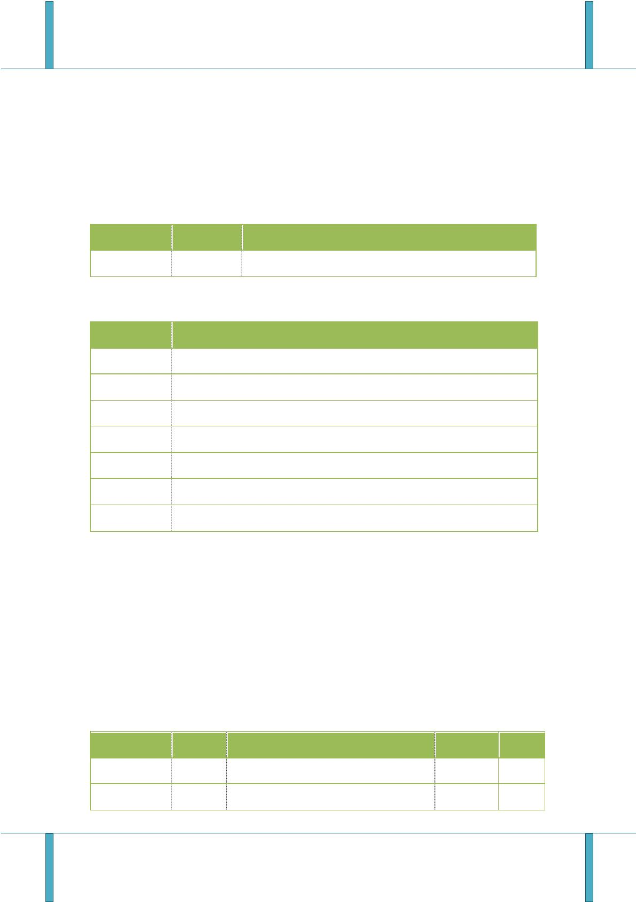

JFaster智能开发平台

UI标签库帮助文档

autoLoadData

queryMode

actionUrl

pagination

title

boolean

string

>   true

single

>   null

数据列表是否自动加载

查询模式：组合查询= group，单查

从远程请求数据的地址

是否显示分页条

否

否

是

否

否

否

否

否

否

否

否

=single

string

boolean

string

true

>   null

表格标题

idField

string

null

标识字段，或者说主键字段

表格宽度

width

num

auto

auto

false

true

>   null

height

num

表格高度

checkbox

fit

boolean

boolean

string

是否显示复选框

是否允许表格自动缩放，以适应父容器

定义的列进行排序

sortName

定义列的排序顺序，只能是"递增"或"降

序（asc,desc）

sortOrder

string

asc

否

否

当为 true时，自动展开/合同列的大小，

以适应的宽度，防止横向滚动

是否显示分页条数下拉框

是否显示刷新按钮

fitColumns

boolean

true

showPageList

showRefresh

showText

style

boolean

boolean

boolean

string

>   true

>   true

>   true

easyui

>   10

否

否

否

否

否

是否显示分页文本内容

插件类型有 easyui和 datatable2种

每页显示的记录数

pageSize

num

2.1.3.方法

方法名

传入参数

描述

reloadTable

无

重新加载数据

reload+name

重新加载数据 name是表格唯一标示

获取选定行传入字段的值

无

get+name+Selected

getSelected

field

field

field

无

获取选定行传入字段的值

get+name+Selections

name+search

获取所有选定行传入字段的数组集合

执行查询前提是 Column列 query设为

true

论坛：*www.JFaster.org*

QQ群: 106259349, 106838471, 289782002

5

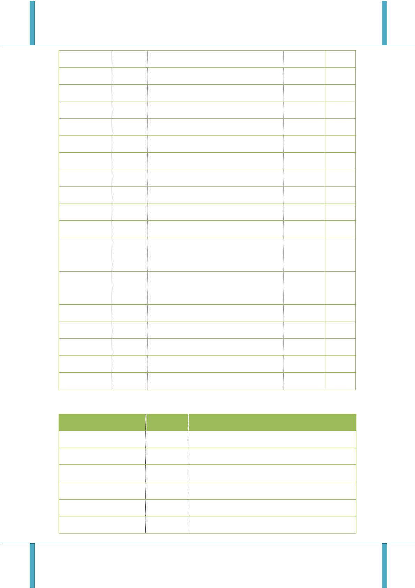

JFaster智能开发平台

UI标签库帮助文档

2.1.4.事件

事件名

传出参数

描述

onClickRow

rowIndex,rowData

rowIndex,rowData

data

行单击事件

行双击事件

onDblClickRow

onLoadSuccess

远程数据加载成功时触发

2.2.

Column(列)子标签

2.2.1.示例

\<t:dgCol title="年龄" field="age" query="true"

extend="{data-options:{required:false,groupSeparator:\\"','\\"},class:{value:'easyui-numberbox'

}}"\>\</t:dgCol\>

2.2.2.参数

属性名

类型

描述

是否必须

默认值

>   null

title

string

列标题文字

是

是

否

>   否

>   否

>   否

field

string

num

列字段名称(操作列字段为 opt)

列宽度

null

width

auto

auto

auto

>   null

rowspan

colspan

queryMode

num

字段跨列

num

字段跨行

string

字段范围查询 queryMode="group"

数据对齐方式,可选值

有:left,right,center

该列是否排序

align

string

left

否

sortable

checkbox

formatter

hidden

boolean

boolean

string

true

false

>   null

否

否

否

否

否

否

是否显示复选框

时间格式化

boolean

string

false

>   null

是否隐藏该列

replace

列值替换

treefield

string

null

树形数据表对应模型字段

论坛：*www.JFaster.org*

QQ群: 106259349, 106838471, 289782002

6

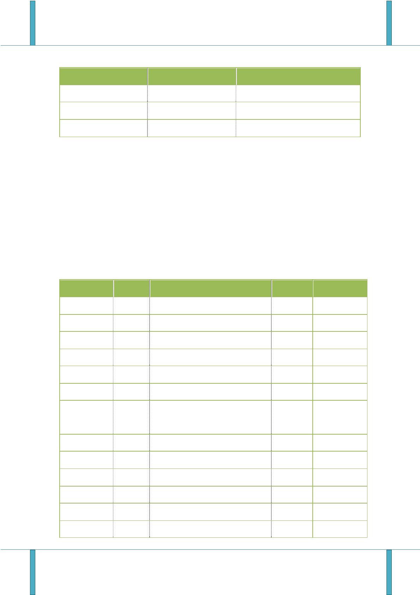

JFaster智能开发平台

UI标签库帮助文档

image

boolean

boolean

boolean

string

false

false

该列是否是图片

否

否

否

否

否

frozenColumn

query

是否冰冻列

false

是否把该列作为查询字段

链接的自定义函数例：fun(title,url)

给该列加链接

funname

url

openwindow

>   null

string

自定义查询字段的 html属性（在

extend中填写的内容使用 json格式。

在 extend中自定义的属性会作为

html属性添加到查询框 input内）

extend

string

Null

否

2.3.

Operate(操作 )子标签

2.3.1.删除操作标签

参数名

描述

url

删除请求地址参数形式 id={id}

operationCode

title

权限操作码，对应按钮权限配置（不设置该字段表示不进行按钮权限控制）

操作标题

message

exp

询问内容

是否显示表操作的表达式

funname

自定义函数名称

\<t:dgDelOpt url="userController.do?delUser&id={id}"
title="删除"\>\</t:dgDelOpt\>

用法

2.3.2.自定义函数操作标签

参数名

描述

funname

title

自定义函数可传出任意字段

操作标题

operationCode

exp

权限操作码，对应按钮权限配置（不设置该字段表示不进行按钮权限控制）

是否显示表操作的表达式

用法

\<t:dgFunOpt funname="edit(id)" title="修改"/\>

论坛：*www.JFaster.org*

QQ群: 106259349, 106838471, 289782002

7

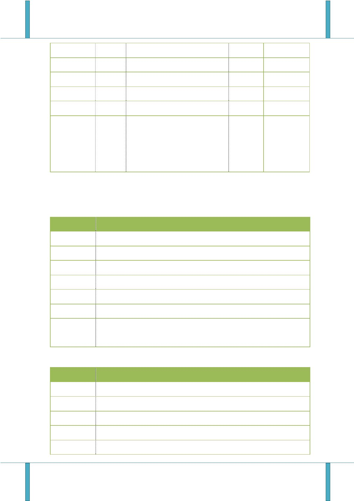

JFaster智能开发平台

UI标签库帮助文档

2.3.3.弹出窗操作标签

参数名

描述

url

弹出页面地址

操作标题

title

operationCode

exp

权限操作码，对应按钮权限配置（不设置该字段表示不进行按钮权限控制）

是否显示表操作的表达式

widht

height

用法

弹出窗宽度(百分比)默认100%

弹出窗高度(百分比)默认100%

\<t:dgOpenOpt url="expertController.do?expert&id={id}"
title="弹出窗"\>\</t:dgOpenOpt\>

2.3.4.询问操作标签

参数名

描述

url

弹出页面地址

title

操作标题

operationCode

message

exp

权限操作码，对应按钮权限配置（不设置该字段表示不进行按钮权限控制）

询问内容

是否显示该操作的表达式

用法

\<t:dgConfOpt url="" message="是否禁用?" title="禁用"\>\</t:dgConfOpt\>

2.3.5.列表工具条标签

参数名

描述

url

方法请求地址

operationCode

icon

权限操作码，对应按钮权限配置（不设置该字段表示不进行按钮权限控制）

图标

title

标题

funname

用法

自定义函数

\<t:dgToolBar title="部门编辑"icon="icon-edit"
url="departController.do?update"funname=

论坛：*www.JFaster.org*

QQ群: 106259349, 106838471, 289782002

8

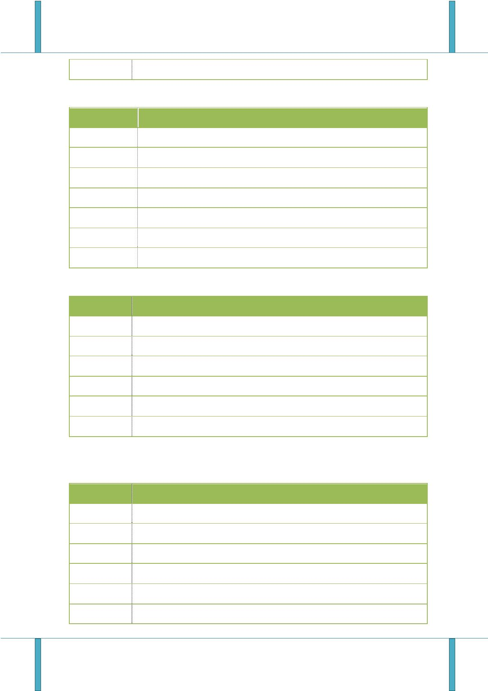

JFaster智能开发平台

UI标签库帮助文档

"update"\>\</t:dgConfOpt\>

2.3.6.列表询问操作

参数名

描述

url

方法请求地址

operationCode

title

权限操作码，对应按钮权限配置（不设置该字段表示不进行按钮权限控制）

操作标题

message

询问内容

是否显示改链接的表达式,例字段名\#表达式符号\#字段值

(name\#eq\#admin)表达式类型支持eq,ne,empty

\<t:dgConfOpt exp="Prjstatus_code\#eq\#new"

exp

用法

url="activitiController.do?startBusProcess&businessKey={id}&busconfigKey={TSBusConfig_id}"

message="确认完毕,提交申请?" title="办理"\>\</t:dgConfOpt\>

3. FormValidation(表单提交及验证标签)

3.1.参数

属性名

类型

描述

是否必须

默认值

>   null

action

string

表单提交路径

表单唯一标示

否

是

否

否

否

否

否

是

否

formid

string

boolean

string

string

string

string

string

string

formobj

>   true

refresh

dialog为 true时是否刷新父页面

表单提交完成后的回调函数

表单提交前的处理函数

callback

beforeSubmit

btnsub

null

null

触发表单提交事件的按钮 ID

触发表单重置事件的按钮 ID

表单布局方式(div和 table可选)

表单外调插件名称(可选插

>   btn_sub

btn_reset

>   div

btnreset

layout

usePlugin

null

论坛：*www.JFaster.org*

QQ群: 106259349, 106838471, 289782002

9

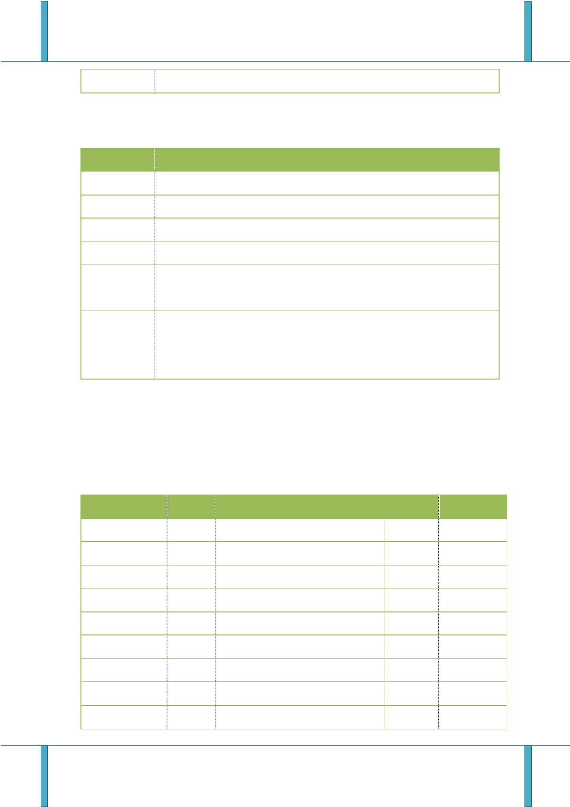

JFaster智能开发平台

UI标签库帮助文档

件,jqtransform:表单美化)

是否是弹出窗口模式

表单布为 div时多选项卡布局分组标

题

dialog

boolean

string

是

否

否

true

null

>   4

tabtitle

**tiptype**

string

表单校验提示方式

3.2.用法 (div)

\<t:formvalid formid="formobj" layout="div" dialog="true"
action="roleController.do?saveRole"\>

\<fieldset class="step"\>

\

\<label class="Validform_label"\>字段标题:\</label\>

\<input name="roleName" class="inputxt" value="\${role.roleName }"
datatype="s2-8"\>

\字段说明\</span\>

>   \</div\>

\</fieldset\>

\</t:formvalid\>

3.3.表单校验提示方式 (**tiptype**)

1

2

>   自定义弹出框提示；onblur的时候就会提示，当输入正确后，1秒中后会自动消失。

>   侧边提示(会在当前元素的父级的 next对象的子级查找显示提示信息的对象，表

单以 ajax提交时会弹出自定义提示框显示表单提交状态)；

3

4

侧边提示(会在当前元素的 siblings对象中查找显示提示信息的对象，表单以 ajax

提交时会弹出自定义提示框显示表单提交状态)；

侧边提示(会在当前元素的父级的 next对象下查找显示提示信息的对象，表单以

ajax提交时不显示表单的提交状态)

3.4.用法 (table)

\<t:formvalid formid="formobj" layout="table" dialog="true"
action="roleController.do?save"\>

\<tr\>

\<td align="right" width="10%" nowrap\>

>   \<label class="Validform_label"\>

>   字段标题:

\</label\>

论坛：*www.JFaster.org*

QQ群: 106259349, 106838471, 289782002

10

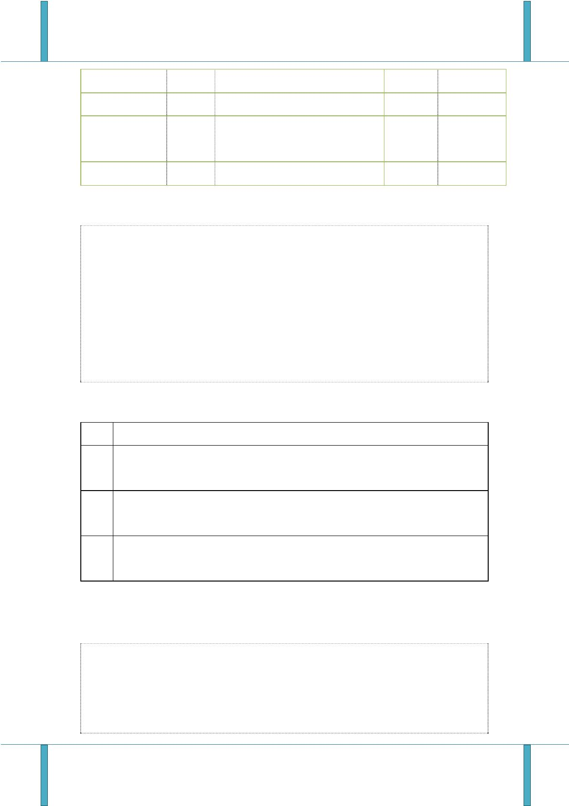

JFaster智能开发平台

UI标签库帮助文档

\</td\>

\<td class="value" width="10%"\>

\<input id="realName" class="inputxt" name="realName" value="\${user.realName }"
datatype="s2-10"\>

\字段说明\</span\>

>   \</td\>

\</tr\>

\</t:formvalid\>

4. Upload(上传标签)

4.1.参数

属性名

类型

描述

是否必须

默认值

id

string

上传控件唯一标示

是

>   是

null

name

string

string

string

控件 name

null

null

null

上传文件提交后台的其他表单参数取

ID

formData

uploader

否

是

上传提交路径

上传文件扩展名(可选类型组

1,pic[\*.jpg;\*,jpeg;\*.png;\*.gif;\*.b

mp;\*.ico;\*.tif],2,office[\*.doc;\*.doc

x;\*.txt;\*.ppt;\*.xls;\*.xlsx;\*.html

;\*.htm

extend

string

是

])

buttonText

multi

string

控件按钮显示文本

否

否

否

否

否

否

否

否

浏览

boolean

string

true

true

true

null

true

null

null

是否允许选择多文件

queueID

dialog

显示预上传文件列表的对象 ID

是否是对话框模式打开上传控件

所有文件上传完成后回调函数

是否是自动上传

boolean

string

callback

auto

boolean

string

onUploadSuccess

view

上传成功的处理函数

string

是否生成查看删除链接默认 false,如为

论坛：*www.JFaster.org*

QQ群: 106259349, 106838471, 289782002

11

JFaster智能开发平台

UI标签库帮助文档

true需要在后台返回 JSON中添加查看

参数(viewhref)和删除参数(delurl)

4.2.用法

\<t:upload name="instruction" dialog="false" queueID="instructionfile"
view="true" auto="true"

uploader="systemController.do?save" extend="pic" id="instruction"

formData="documentTitle"\>

\</t:upload\>

5. Tabs(选项卡父标签)

5.1.

Tabs容器参数

属性名

类型

描述

是否必须

>   是

默认值

>   null

>   auto

>   auto

false

false

>   true

>   true

>   100

id

string

控件唯一标示

选项卡宽度

选项卡高度

简单模式

width

heigth

plain

fit

string

否

string

否

boolean

boolean

boolean

否

是否适应父容器

是否显示边框

否

border

否

scrollIncrement string

scrollDuration boolean

滚动像素数

否

每个卷轴动画的毫秒数

选项卡工具条

否

tools

tabs

string

boolean

string

否

400

是否创建父容器

是否是iframe方式创建

选项卡位置:

否

true

null

iframe

否

否

tabPosition

string 'top','bottom','left','ri

>   ght'

top

论坛：*www.JFaster.org*

QQ群: 106259349, 106838471, 289782002

12

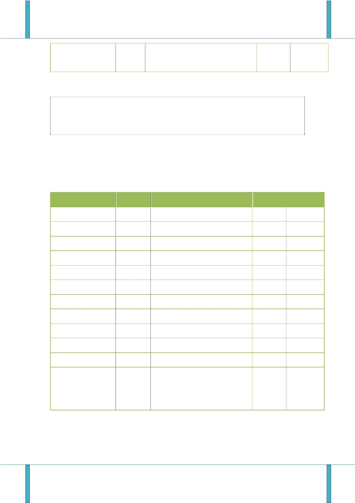

JFaster智能开发平台

UI标签库帮助文档

5.2.

Tab(选项卡子标签 )

5.2.1.

Tab子标签参数

属性名

类型

描述

是否必须

默认值

>   null

id

string

控件唯一标示

是

否

否

是

否

否

否

否

否

href

string

Href方式请求地址

Iframe方式请求地址

选项卡标题

null

iframe

title

string

null

string

false

false

>   100%

icon

string

选项卡图标

width

string

选项卡宽度

heigth

cache

string

选项卡高度

99.5%

>   true

boolean

boolean

选中时是否重新发送请求

是否带关闭按钮

closable

false

5.3.用法

\<t:tabs id="tt" iframe="false" tabPosition="bottom"\>

>   \<t:tab iframe="demoController.do?aut" icon="icon-search" title="自动上传"
>   id="o"\>\</t:tab\>

>   \<t:tab iframe="demoController.do?" icon="icon-search" title="普通上传"
>   id="t"\>\</t:tab\>

\</t:tabs\>

6. Autocomplete(自动补全标签)

6.1.参数

属性名

类型

描述

是否必须

默认值

>   null

>   2

name

string

控件唯一标示

是

否

是

是

是

是

minLength

string

string

string

string

string

触发提示文字长度

提示显示的字段

查询关键字字段

传递后台的字段

实体名称

labelField

searchField

valueField

entityName

null

null

null

null

论坛：*www.JFaster.org*

QQ群: 106259349, 106838471, 289782002

13

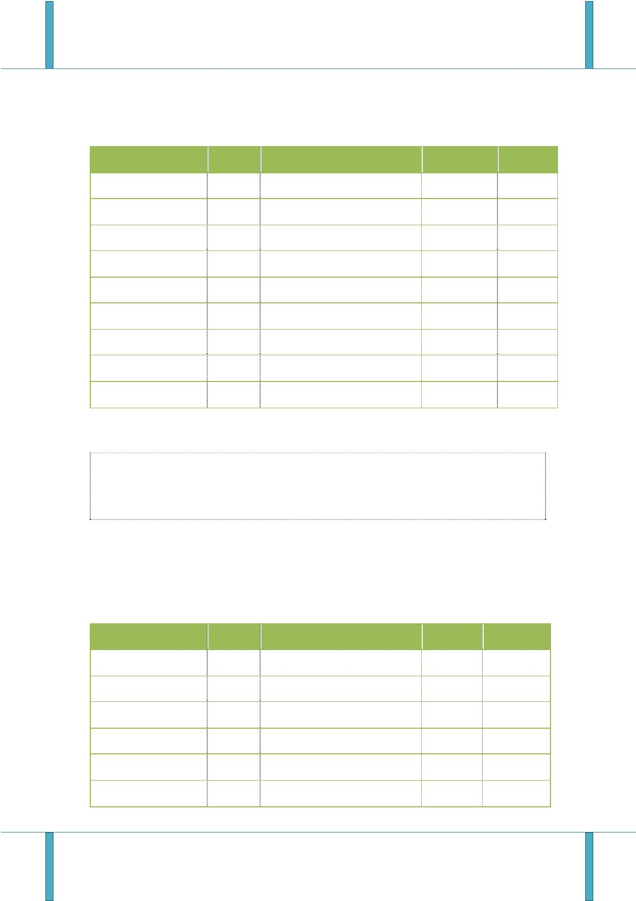

JFaster智能开发平台

UI标签库帮助文档

selectfun

label

string

string

string

string

string

string

string

选中后调用的函数

传入显示值

否

否

否

否

否

否

否

null

null

null

null

null

null

null

value

传入隐藏域值

datatype

nullmsg

errormsg

closefun

数据验证类型

数据为空时验证

数据格式不对时验证

没有选择下拉项目的处理函数

6.2.用法

\<t:autocomplete selectfun="aa" closefun="close" valueField="id"
searchField="username"

labelField="username,realName" name="user" entityName="User" datatype="\*"
nullmsg="请

输入关键字" errormsg="数据不存在,请重新输入"\>\</t:autocomplete\>

7.

ComboBox (下拉选择框)

7.1.参数

属性名

类型

描述

是否必须

默认值

>   null

>   null

>   null

>   null

>   null

>   null

>   null

name

string

控件名称

是

是

是

是

否

否

否

url

string

string

string

string

string

string

远程数据访问

唯一标识

显示文本

宽度

id

text

width

listWidth

listHeight

下拉框宽度

下拉框高度

7.2.用法

\<t:comboBox url="JFasterDemoController.do?combox" name="sex" text="username"

id="id"\>\</t:comboBox\>

论坛：*www.JFaster.org*

QQ群: 106259349, 106838471, 289782002

14

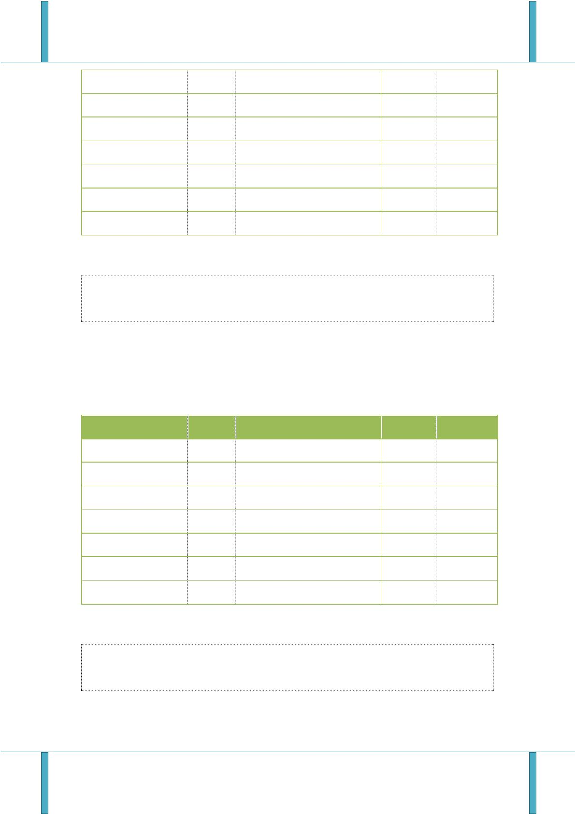

JFaster智能开发平台

UI标签库帮助文档

8. Menu(左侧菜单生成标签)

8.1.参数

属性名

类型

描述

是否必须

默认值

>   null

>   null

>   null

style

string

菜单样式

一级菜单

二级菜单

否

是

是

parentFun

childFun

string

string

8.2.用法

\<t:menu parentFun="\${parentFun}" childFun="\${childFun} " \>\</t:menu\>

9. Choose(选则操作标签)

9.1.参数

>   属性名

hiddenName

hiddenid

textname

name

类型

描述

是否必须

>   否

默认值

>   null

>   null

>   null

>   null

>   null

>   null

>   null

>   null

>   null

>   null

>   null

false

string

隐藏域的 ID

隐藏框 id

文档名称

名称

string

string

string

string

string

string

string

string

string

string

boolean

否

否

是

icon

选择按钮的图标

弹出框的高度

弹出框的宽度

弹出框的左间距

弹出框的上端间距

远程访问地址

标题

是

height

width

否

否

left

否

top

否

url

是

title

是

isclear

是否清空

否

论坛：*www.JFaster.org*

QQ群: 106259349, 106838471, 289782002

15

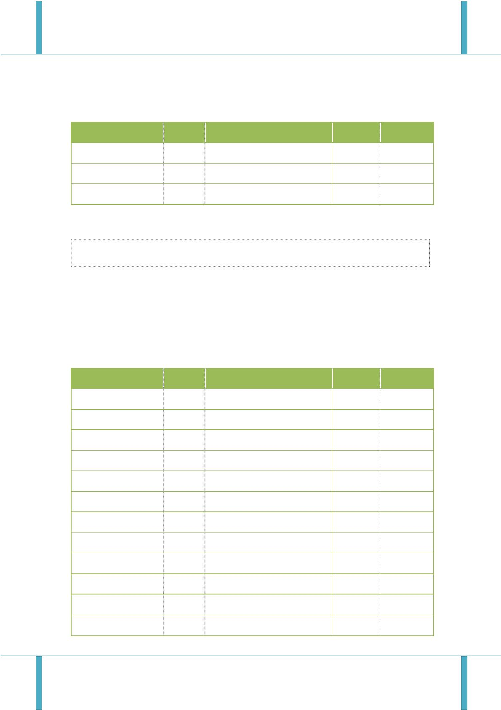

JFaster智能开发平台

UI标签库帮助文档

fun

string

自定义函数

否

null

9.2.用法

\<t:choose hiddenName="logName" hiddenid ="log1" textname ="hello"
icon="customIcon"

width=123 height=123 title="标题" isclear=true\>\</t:choose\>

10.Form（form标签）

10.1.参数

属性名

类型

描述

是否必须

默认值

>   null

>   null

action

string

表单提交地址

否

是

items

string

循环集合值

10.2.

用法

\<t:form action=＂userAction＂ items =null\>\</t:form\>

11. ComboTree(下拉树形选择框)

11.1.参数

属性名

类型

描述

是否必须

默认值

>   null

>   null

>   null

>   null

>   null

>   null

false

name

name

url

string

控件唯一标示

是

是

是

是

否

否

否

string

string

string

string

string

boolean

控件名称

远程数据访问

唯一标识

树形宽度

树形值

id

width

value

multiple

是否多选

论坛：*www.JFaster.org*

QQ群: 106259349, 106838471, 289782002

16

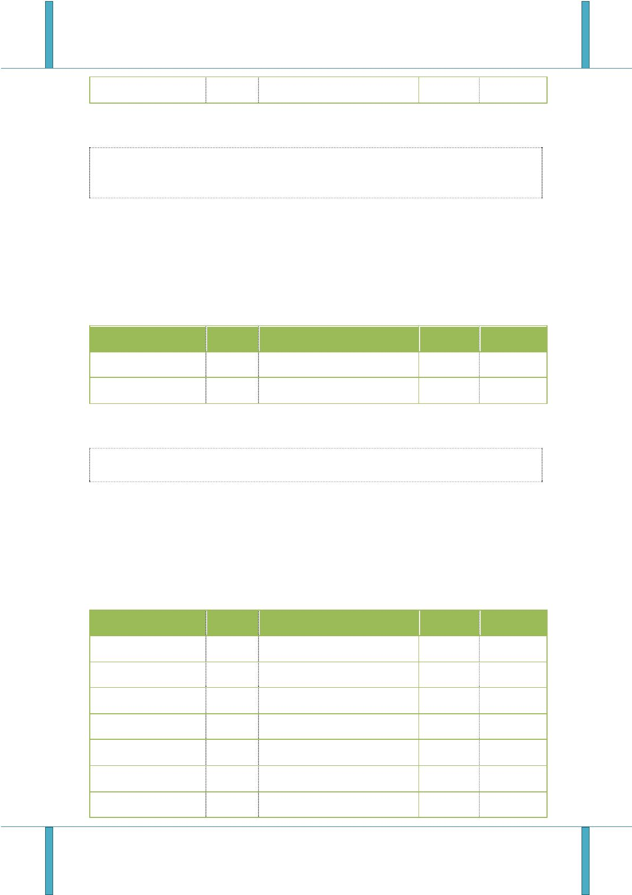

JFaster智能开发平台

UI标签库帮助文档

11.2.

用法

＜t：comboTree url=＂url＂ name=＂JFasterName＂ text=＂项目管理＂ id=＂combo1＂

width=120 value="test" multiple=true＞＜／t：comboTree＞

12.Colorchange (改变 HTML控件颜色)

13.DictSelect (数据字典下拉选择框)

13.1.参数

>   属性名

typeGroupCode

field

类型

描述

是否必须

默认值

>   null

string

字典分组编码

是

是

否

否

否

否

否

string

string

string

string

string

null

对应表单

唯一标识

显示文本

默认值

id

null

title

null

defaultVal

divClass

null

DIV框默认样式

form

Validfor

>   m_label

labelClass

string

LABEL默认样式

13.2.

用法

\<t:dictSelect field="name" typeGroupCode="process"
title="流程类型"\>\</t:dictSelect\>

论坛：*www.JFaster.org*

QQ群: 106259349, 106838471, 289782002

17

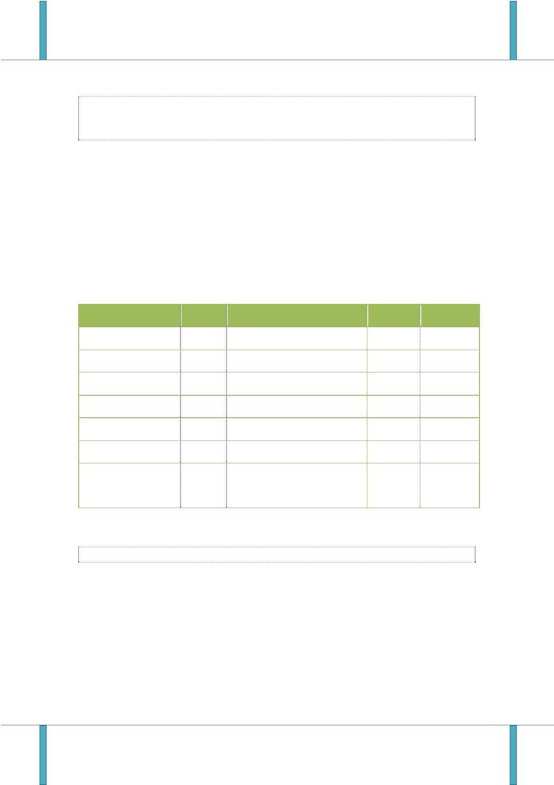
